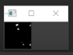

# Morsedream

## About
A Python implementation of a Morse code translator. Uses a Raspberry Pi to encode text into Morse Code which is flashed by an LED. A second computer with a webcam is then used to decode the LED flashes into human-readable text. Written by Alex Todd and Jake Broughton

## Setup
1. Connect an LED to GPIO 18 on the Raspberry Pi.
2. Connect a 470\ohm resistor between the LED's ground pin and ground on the Raspberry Pi
3. Ensure `TextToLights.py` and `morse_function.py` is on the Rasberry Pi and the rest of the files are on a computer with a webcam.

## Usage

1. Run `opencv_reverse.py`, which will bring up a video feed from the computer's primary webcam. It will ask `how long for a dot?`. This question is also asked by the script ran on the Raspberry Pi, and need to be consistent. A value of 0.2 seconds is reasonable. 

2. Place the LED in view of the camera feed, then double click the LED to place a green box around it. Three smaller windows will pop up, showing the cropped video, greyscale video and video with threshold applied. 
3.  You may need to adjust the threshhold value in the code. The threshold video feed should be almost entirely black.

 
 
 
 

4. Log into the Raspberry Pi and run `TextToLights.py`. Enter the same dot time length as entered in step 1 when prompted. Enter a phrase to translate when prompted, and hit enter.

5. Once `TextToLights.py` has finished running, close `opencv_reverse.py`, which will return the translated phrase entered in step 4.

## Video Demonstration

## Requirements
Requirements listed in requirements.txt are as follows:
- opencv-python~=4.5.1.48
- numpy~=1.20.1

